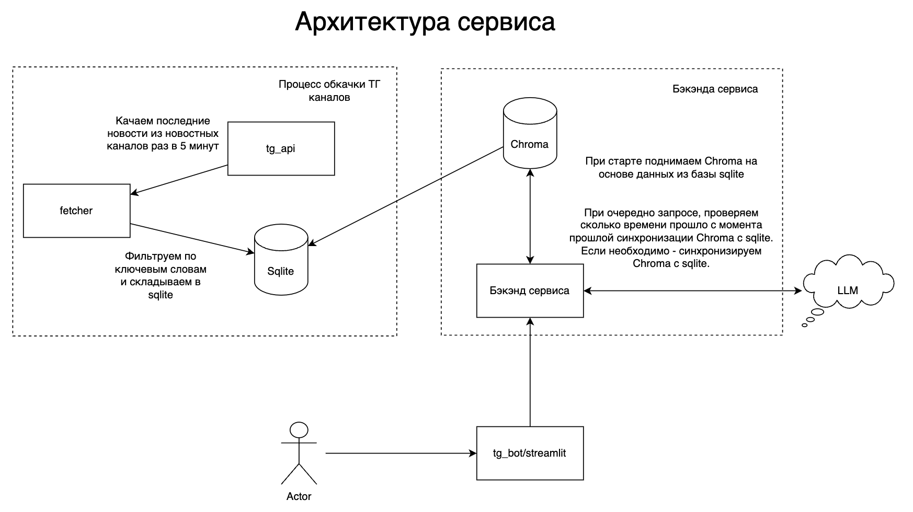

# Бот для суммаризации новостей о СИМ
## Архитектура

## Описание

Система мониторинга и анализа новостей в сфере электросамокатов, построенная на базе RAG-архитектуры. Система автоматически собирает информацию из новостных Telegram-каналов.

При работе в специализированной области критически важно быть в курсе последних событий и изменений. В случае работы в сфере электросамокатов важно постоянно отслеживать:

- Тенденции рынка
- Изменения в законодательном регулировании СИМ
- Вопросы безопасности и статистики происшествий

Разработанная система автоматизирует этот процесс, предоставляя актуальную аналитику для принятия решений в индустрии электросамокатов.

На текущий момент парсятся следующие каналы:
- [Москва сейчас](https://t.me/mosnow)
- [Московская хроника](https://t.me/mosnoow)
- [Shot](https://t.me/shot_shot)
- [Дептранс Москвы](https://t.me/DtRoad)
- [Дептранс. Оперативно](https://t.me/DtOperativno)
- [Госавтоинспекция России](https://t.me/guobddrus)

-------------------
*P.S. Если что-то не работает или вам есть чем поделиться (например, каналами с новостями про самокаты) пишите [httpkt](https://t.me/htppkt)*